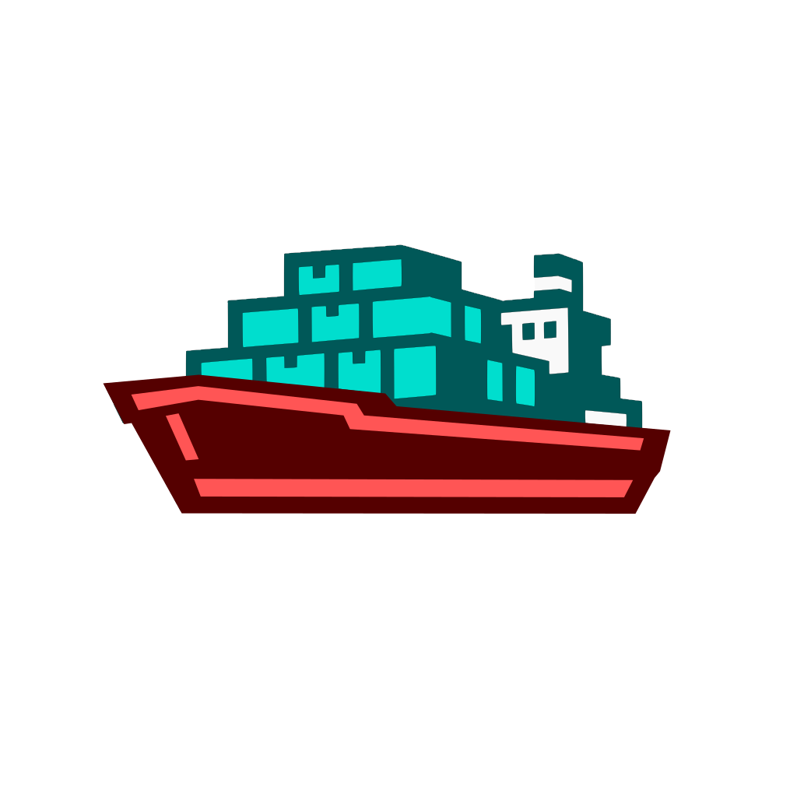

# Shipctl

**A native macOS workspace for developers running projects, terminals, and AI coding agents side by side.**

Shipctl gives each repo one place for its terminals, coding assistants (Codex CLI,
Claude Code, Antigravity CLI), saved commands, git-aware views, and usage
tracking — instead of a pile of shell tabs and half-remembered commands.

<p align="center">
  
</p>

## Architecture

Shipctl is organized as a capability-owned host with independently removable
modules. Frontend and backend capabilities live under `core/`, modules live
under `modules/`, and repository operations live under `ops/`.

## Requirements

- macOS, and a local git repo to work from
- Any CLI agents you want to launch, already installed
- To build: Node.js 20+, `pnpm`, Rust 1.88+ via `rustup`, Xcode Command Line Tools

## Build and run

```bash
pnpm install
pnpm tauri dev      # dev
pnpm tauri build    # production bundle
```

Run `just` for repository commands and `just ops skills` for procedures; see
`docs/ops/overview.md`.

## Install and update

Shipctl will use one macOS Homebrew cask. It installs `shipctl.app` and exposes
the CLI inside that app as `shipctl` on your shell path. The first cask will be
published with the first signed release.

```bash
brew install --cask ddebowczyk/shipctl/shipctl
shipctl --help
open -a shipctl
```

Homebrew owns updates and removal:

```bash
brew update
brew outdated --cask shipctl
brew upgrade --cask shipctl
brew uninstall --cask shipctl
```

There is no separate CLI installer. The app bundle contains both `shipctl-ui`
and the lean `shipctl` command.

## Configuration

- Per project: `<repo>/.shipctl/workspace.yml`
- Machine-wide: `~/.shipctl/config.yml`

## Project structure

The host and its modules are organised by *capability* — each owns its logic,
state, and assets in one directory, never by file kind.

```text
core/frontend/   host capabilities (package @shipctl/core) — read its README first
core/backend/    host capabilities in Rust (crate shipctl-core)
modules/         pluggable features, each removable from a build
src-tauri/       the Tauri shell — no capability logic lives here
ops/             build, check, test, modularity, and upstream tooling
```

Two rules are enforced in CI: a module may never import the host, and the host
reaches modules only through `@shipctl/module-api` and
`core/frontend/host/enabledModules.ts`. Verify with
`just modularity plugout <name>`.

## License

MIT
